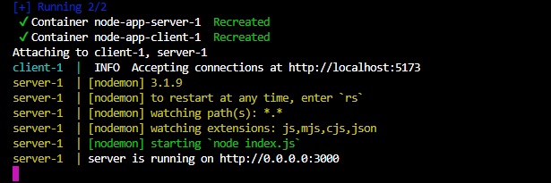

# Node APP - Dockerizado (básico)

El proyecto tiene dos partes
- **Backend (server)**: Un servidor Node.js que muestra un mensaje si está corriendo en el puerto establecido.
- **Frontend (client)**: Una aplicación frontend construida con React y TypeScript (un simple h1, no es la gran cosa).

La aplicación usa **Docker** para ejecutar ambos servicios (cliente y servidor) en contenedores.

## Requisitos

Antes de empezar, tenés que tener instalado:
- **Node.js y npm**: [Descargar Node.js](https://nodejs.org/)
- **Docker Compose** (incluye Docker Desktop): [Descargar Docker](http://www.docker.com/products/docker-desktop)
- **Git**: Para clonar el repositorio.

## Opción 1. Ejecutar con Docker

Podés usar Docker para ejecutar ambos servicios a la vez en contenedores.

### 1. Cloná el repositorio
```bash
git clone https://github.com/pblnahu1/app-dockerized.git
cd app-dockerized
```

### 2. Construir y Levantar los Contenedores
Usa Docker Compose para construir las imágenes y levantar los contenedores del cliente y del servidor:
```bash
docker-compose up --build
```
Esto:
- Construirá las imagenes para el servidor y el cliente.
- Levantará los contenedores para ambos servicios.

### 3. Acceder a la aplicación
- Cliente estará en `http://localhost:5173`
- Servidor estará en `http://localhost:3000`

### 4. Para detener los contenedores
```bash
docker-compose down
```

### Debería verse algo así


### ¿Por qué `http://0.0.0.0:3000`?
En el contexto de contenedores como Docker, 0.0.0.0 significa que el servidor está escuchando en **todas las interfaces de red disponibles dentro del contenedor.**
1. Flexibilidad en los contenedores:
    - Cuando configurás un servidor para escuchar en `0.0.0.0`, le estás diciendo que acepte conexiones desde cualquier dirección IP que tenga acceso al contenedor.
    - Esto es especialmente útil dentro de Docker porque el contenedor tiene su propia red interna.
2. Mapeo de puertos:
    - En Docker, mapeas puertos entre el contenedor y el host (por ejemplo, `3000:3000` en nuestro caso). Esto significa que las conexiones externas llegan al contenedor a través de ese puerto.
    - Si el servidor solo escucha en `localhost` o `127.0.0.1` dentro del contenedor, **solo aceptará conexiones internas al contenedor**, y no se podrá acceder al servidor desde fuera (como desde el navegador).
3. Comportamiento predeterminado de Node.js:
    - Si no especificas `0.0.0.0` y usás `localhost` o `127.0.0.1`, Node.js estará disponible **solo dentro del contenedor**, lo que hará que no puedas acceder desde tu máquina anfitriona (host).
4. ¿Cómo se traduce al usar el navegador?
    - Aunque el servidor está configurado para escuchar en `0.0.0.0` dentro del contenedor, **Docker hace el trabajo de mapearlo al host.** Por eso, desde tu navegador siempre accedes al puerto:
        - `http://localhost:3000`: Esto funciona porque Docker mapea el puerto `3000` del contenedor al puerto `3000` de tu host.
    - Dentro del contenedor `0.0.0.0:3000` -> Mapeo de Docker -> Host: `localhost:3000`
5. ¿Si uso `localhost` en vez de `0.0.0.0` en mi servidor?
    - Si configurás tu servidor para que escuche solo en `localhost`:
        - Dentro del contenedor: El servidor funcionará bien y responderá a las conexiones internas (por ejemplo, desde otro proceso en el mismo contenedor).
        - Desde fuera del contenedor (por ejemplo, el navegador): **No funcionará**, porque el contenedor no permitirá conexiones externas hacia `localhost`.
    - Por eso, siempre que trabajes con Docker, es mejor usar `0.0.0.0` para asegurarte de que el servidor está accesible desde fuera del contenedor.
6. ¿Qué pasa si no uso Docker?
    - Si no usás Docker y ejecutás tu servidor localmente:
        - `localhost` o `127.0.0.1` funcionan perfectamente, ya que no necesitás preocuparte por redes internas de contenedores.

### La red `app-network` y la configuración `0.0.0.0` trabajan en conjunto para permitir que los servicios dentro de los contenedores puedan comunicarse y también que el host pueda acceder a ellos.

1. ¿Qué hace `app-network`?
Cuando definís la red `app-network` en tu archivo `docker-compose.yml`, estás creando una red de Docker específica donde los contenedores (en este caso, server y client) pueden comunicarse directamente entre sí, como si estuvieran conectados a una misma red local.
**Ventajas de una red personalizada (app-network):**
    - **Aislamiento**: Los servicios en `app-network` están aislados de otros contenedores que no forman parte de esta red.
    - **Resolución de nombres**: Los contenedores pueden comunicarse entre sí usando los nombres de sus servicios (por ejemplo, el cliente puede comunicarse con el servidor simplemente usando `http://server:3000`).
2. ¿Qué hace `0.0.0.0`?
Por defecto, cuando un servidor (como Node.js) está configurado para escuchar en `0.0.0.0`, acepta conexiones desde cualquier interfaz de red que esté disponible:
    - **Desde dentro del contenedor**: Esto permite que otros contenedores en la misma red (por ejemplo, client) puedan acceder al servidor.
    - **Desde fuera del contenedor (el host)**: Cuando mapeas el puerto con Docker (por ejemplo, `3000:3000`), `0.0.0.0` asegura que el servidor acepte conexiones externas desde tu host.
3. ¿Cómo trabajan `app-network` y `0.0.0.0` juntos?
    - **Comunicación entre contenedores (red interna)**:
        - Gracias a `app-network`, los contenedores pueden encontrarse usando los nombres de los servicios (server y client) en lugar de direcciones IP.
        - Por ejemplo, el cliente puede acceder al servidor con http://server:3000.
    - **Acceso desde el host**:
        - 0.0.0.0 asegura que el servidor escuche en todas las interfaces de red, incluyendo la interfaz creada por Docker para mapear puertos.
        - Así, podés acceder al servidor desde tu navegador en http://localhost:3000 (gracias al mapeo 3000:3000).
4. **Conclusión**
    - La red `app-network` asegura la comunicación interna entre contenedores de forma sencilla y controlada.
    - `0.0.0.0` asegura que el servidor esté disponible tanto para otros contenedores como para tu computadora local.

Ambas configuraciones se complementan y son esenciales para que el proyecto funcione de manera flexible dentro de Docker.


## Opción 2. Ejecutar sin Docker (localmente)
Podés ejecutarlo sin usar Docker pero debés tener abierta dos terminales para ambos servicios.

### 1. Cloná el repositorio
```bash
git clone https://github.com/pblnahu1/app-dockerized.git
cd app-dockerized
```

### 2. Instalar dependencias para ambos servicios
```bash
cd server
npm install

cd client 
npm install
```

o desde el root, se instalará todo con un solo comando (igual verificar):

```bash
npm run install
```

### 3. Ejecución
```bash
cd server
npm run dev

cd client
npm run dev
```

